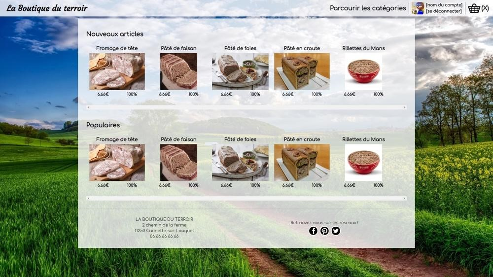
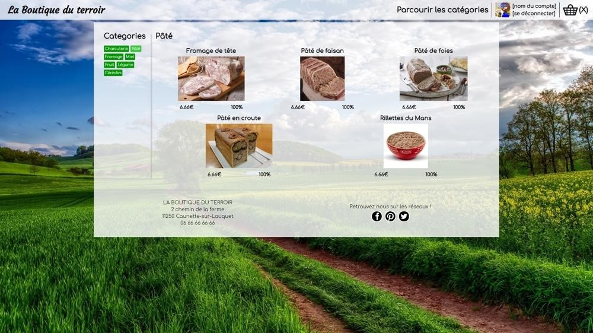
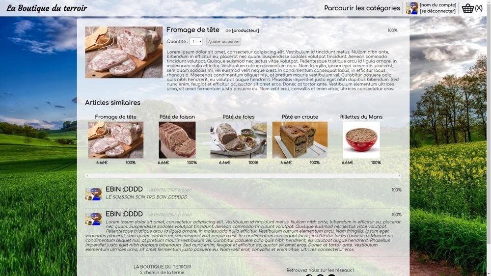

# SiteE-commerce-Jee
A l'occasion d'un cours sur la création de site, nous avons réalisé un site E-Commerce "La Boutique Du Terroir" destiné à vendre des produits frais des régions de france.

Nous avons commencé par planifier les diverses fonctionnlitées du site et la logique métier a l'aide d'UML et de maquettage des différentes pages.

Le site a été réalisé en Java JEE et suis le pattern MVC où les views sont gérées par des JSP, le controller par un servlet et le model par des beans et des entités venant de JPA. 
Le Framework Entity sert pour le mapping de la base de données qui est sauvegardée sur un serveur Glassfish et qui a été réalisé avec l'aide de JMerize. Le tous réalisé sous NetBeans.

# Images
La page d'accueil

La Page de sélection des catégories

La Page de sélection d'un produit avec des commentaires

